# Croc 2 Mod Loader


ASI Mod Loader for Croc 2

Will automatically load `.asi` files from the `mods/` folder.

Additionally, provides a lightweight API for mod developers.

# Compatible versions

-   Tested on the US PC version.
    -   SHA1: `C7E9ED848E311706DDE83116FD122A0B28B99261`
-   Your mileage may vary on other versions!

# Installation instructions

1. Make sure you have [Microsoft Visual C++ Redistributable (x86)](https://aka.ms/vs/17/release/vc_redist.x86.exe) installed
1. Download [dinput8.dll](https://github.com/ThirteenAG/Ultimate-ASI-Loader/releases/download/Win32-latest/dinput-Win32.zip) from ThirteenAG's [Ultimate ASI Loader](https://github.com/ThirteenAG/Ultimate-ASI-Loader)
1. Download the mod loader files from [Releases](https://github.com/Zed-z/c2-mod-loader/releases)
1. Extract both and place them into the game's directory
1. You're done, the game will now load mods from the `mods/` folder!
1. EXTRA: Unpack the provided example mods into the `mods/` folder after installation

# Recommended: Custom GUI support

In order to display custom GUIs, the mod loader needs the game to have [dgVoodoo2](https://dege.freeweb.hu/dgVoodoo2/dgVoodoo2/) applied.

Without it, the mod loader will continue to function, but you will not see the custom GUI overlay.

# Features

## Game launcher

Shows a launcher before starting the game. There, you can enable and disable your mods and change their settings!


## Mouse uncapture

Optionally, the loader can overwrite some game code responsible for capturing the mouse in the game window and making it visible. When enabled, the game never captures your mouse and acts like any other window. Cursor freedom at last!

Big thanks to hdc0 for the game insight that made this possible!

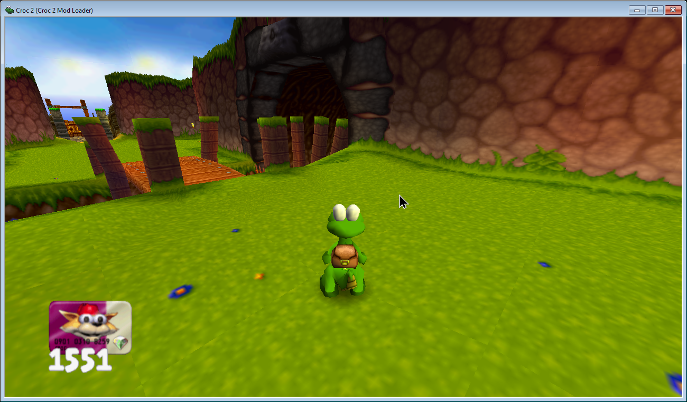

## Custom UI overlay

With the help of ocornut's Dear ImGui, the game can display custom UI elements, providing a look into the game's inner workings.

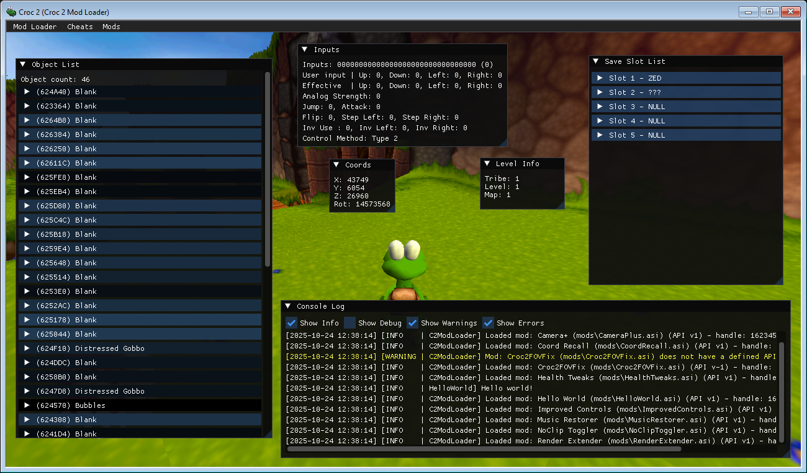

## Mod loading

Croc 2 Mod Loader can load `.asi` mod files that are able to change the game's behavior and even override some assets. Mods can also add options to the menu bar for easy access to different features!

Mods are written in C++ with the help of the provided modding API.

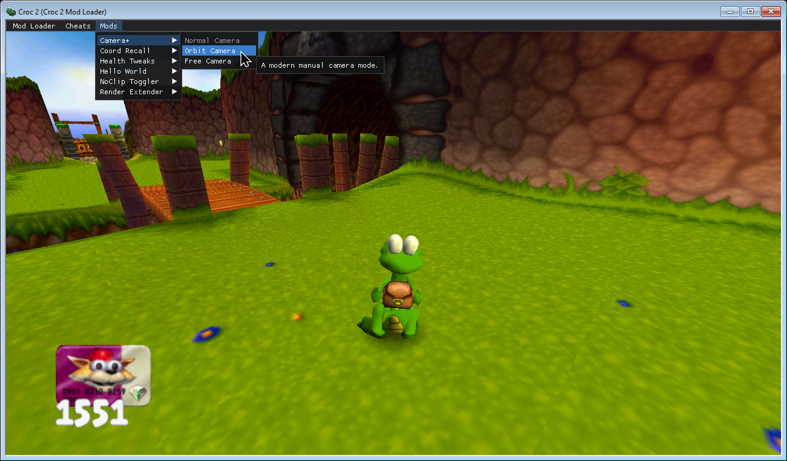

## Cheat code management

Did you know that Croc 2 has cheat codes you can type in on the main menu? They're neat, but pretty tedious to have to type out every time you launch the game.

With Croc 2 Mod Loader, you can manage them with UI options. They also get saved across play sessions!

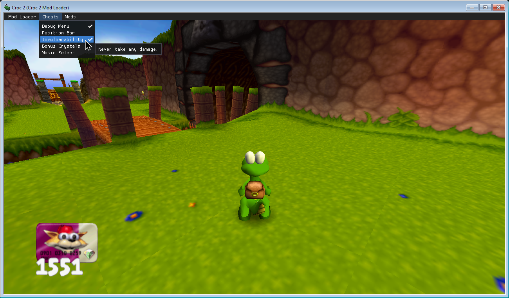

# Provided mods

Alongside the loader, I'm providing a couple of mods. They feature little tweaks and improvements to the game and can be used to learn mod API usage.

## Camera+

Adds extra camera modes, such as a modern Orbit camera and a Free camera that allows you to freely look around the world!

Toggle with `STEP-LEFT + STEP-RIGHT + CAMERA/180` or the dedicated menu bar options!

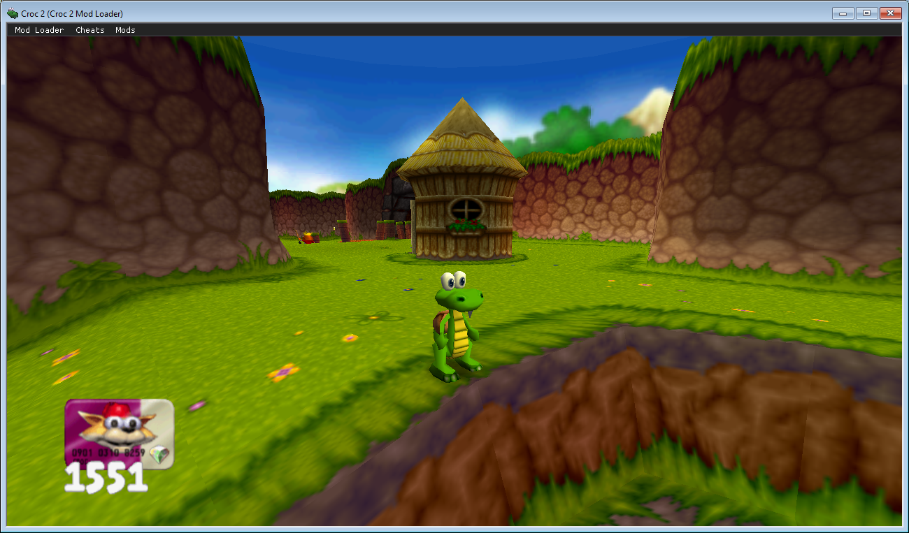
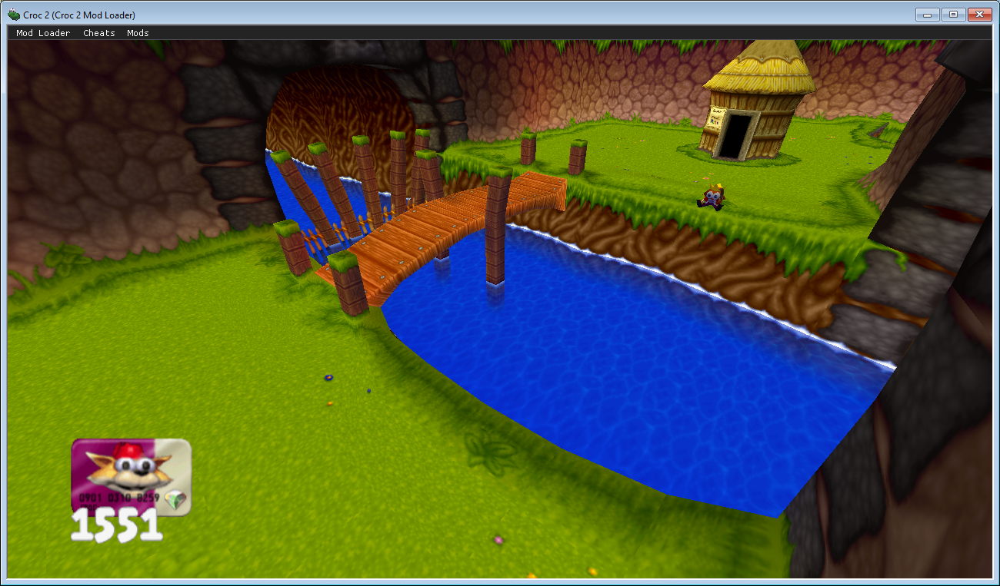

## Coord Recall

Allows you to save and teleport to up to 10 locations! Use either via the menu bar options or the following hotkeys:

-   `F5 + [0-9]` to save
-   `[0-9]` to recall

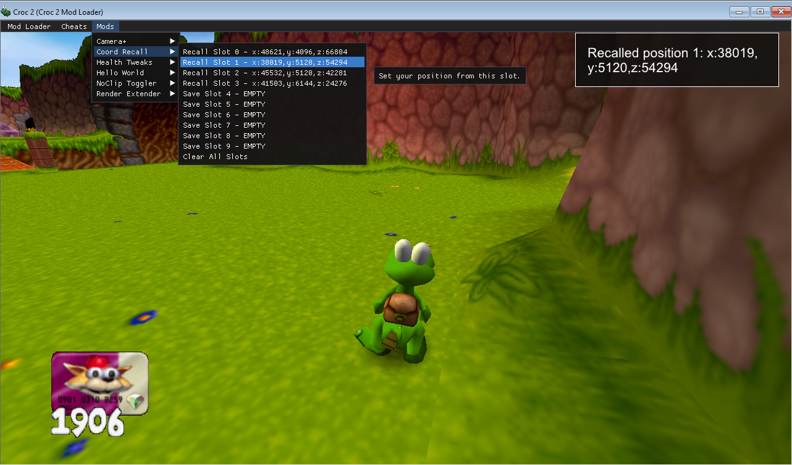

## Health Tweaks

Annoyed at the game's strict health mechanics? Wish the challenge was a bit easier? You can configure the game to:

-   Regain all your health on a game over
-   Regain all your health when entering a level

## Hello World

A dummy mod that logs a simple message. Good to test if the loader is working and not much else.

## Improved Controls

Provides a couple of little improvements to the control scheme! You can configure:

-   `Type 1 Flip` to be able to do a 180 on Type 1 controls with a double press of the camera reset button!
-   `Type Switch Mode` to manually or automatically switch between Type 1 and 2 controls in real time!

## Music Restorer

Restores missing/changed tracks from the PS1 release of the game, notably the alternative Ice Cave theme from "Save the Ice Trapped Gobbos"!

> [!IMPORTANT]  
> Requires `JHub34.asf` and `JIceCave1.asf` files in the `MusicRestorer/music/` folder right next to the mod `.asi` file!

## NoClip Toggler

Allows you to toggle a NoClip state, where you can freely fly and pass through walls. Toggle with `STEP-LEFT + STEP-RIGHT + ATTACK` or the dedicated menu bar option!

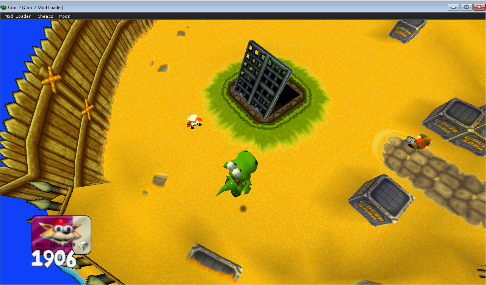
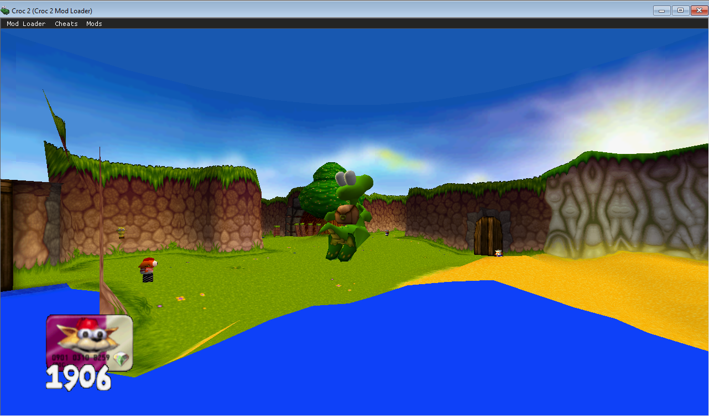

## Render Extender

Allows you to increase the game's render distance greatly. Change between 1-10x render distance on the fly!

Toggle with `F1` and alter with `-`/`+` or the dedicated menu bar options!

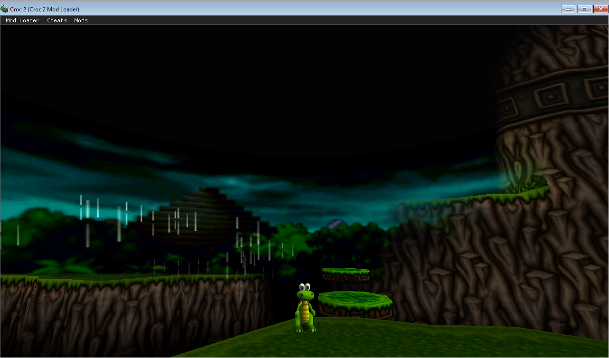
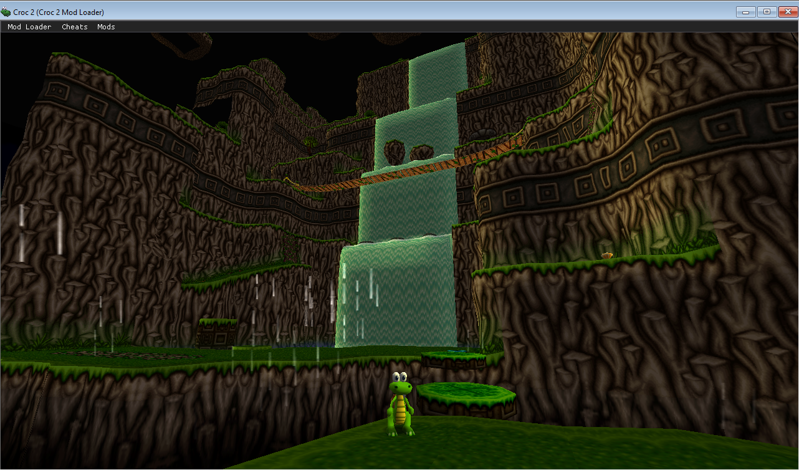

# Recommended mods

Mods not made by me, but worth checking out.

## Croc 2 FOV Fix

A mod that fixes your FOV at widescreen resolutions to prevent stretching. A must have for playing on modern displays. It's a standalone game mod, but you can put it in the `mods/` folder to manage it with Croc 2 Mod Loader!

You can grab it [here](https://community.pcgamingwiki.com/files/file/2969-croc-2-fov-fix/)!

# Mod development

## Prerequisites

1. Install Visual Studio with C++ desktop tools
1. Install CMake and Ninja

## Project setup

### A) From scratch

1. Create a folder in the `Mods/` directory
1. Add a required `dllmain.cpp` entry file
1. Optionally add `Resource.rc` for file metadata (copy from `Mods/ModTemplate`)
1. The toolchain should automatically build any additional `.cpp` files, including subdirectories
1. Add your desired code to `DllMain()` in `dllmain.cpp`
1. Example:

    ```c++
    #include "ModApi.h"
    #include <Windows.h>
    #include <iostream>

    ModApi* api = nullptr;

    BOOL APIENTRY DllMain(HMODULE hModule, DWORD reason, LPVOID) {
    	if (reason == DLL_PROCESS_ATTACH) {
    		api = LoadModApi();
    		if (!api) return FALSE;
    		api->LogInfo("Hello world!");
    	}
    	return TRUE;
    }
    ```

### B) From a template

1. Copy `ModTemplate/` located in the `Mods/` directory
1. Adjust the copied `Resource.rc` metadata fields
1. Modify code in `dllmain.cpp` as needed
1. The toolchain should automatically build any additional `.cpp` files, including subdirectories

## Building

### Windows

1. Run `./build.ps1 -Configuration Release`
1. Mods are autodetected from `Mods/` and built to `build/Release/*.asi`
1. For automatic mod installation and game launching, put Croc 2 game files in `Croc2/mods/` and use the `-Deploy` or `-Launch` flags

### Linux

1. The build requires an installed 32-bit MinGW toolchain.

    Ubuntu
    ```console
    $ sudo apt install mingw-w64
    ```

    Arch
    ```console
    $ sudo pacman -S mingw-w64
    ```

1. Run `build.sh`

# Third-Party Licenses

This project uses the following libraries:

-   [Dear ImGui](https://github.com/ocornut/imgui) - Copyright (c) 2014-2025 Omar Cornut
-   [MinHook](https://github.com/TsudaKageyu/minhook) - Copyright (c) 2009-2017 Tsuda Kageyu

This project contains graphics API implementation code from [Dear ImGui](https://github.com/ocornut/imgui), licensed under the MIT License.

This project uses the [Scabber](https://ggbot.itch.io/scabber-font) font by GGBotNet, licensed under the Creative Commons Zero v1.0 Universal license.

Licenses for the above mentioned are included in `LICENSES/`.

# Special thanks

-   Thanks to ThirteenAG for developing Ultimate ASI Loader (support [here](https://ko-fi.com/thirteenag))
-   Thanks to Dege for developing dgVoodoo2 (support [here](https://dege.freeweb.hu/))
-   Thanks to ocornut for developing Dear ImGui (support [here](https://github.com/ocornut/imgui/wiki/Funding))
-   Thanks to TsudaKageyu for developing Minhook (support [here](https://github.com/TsudaKageyu))
-   Thanks to Thermospore, hdc0, limbus, Ray and Rartrin from the Croc & Stuff Discord server for valuable insight about the game!
-   Thanks to Argonaut Games for developing Croc 2!
