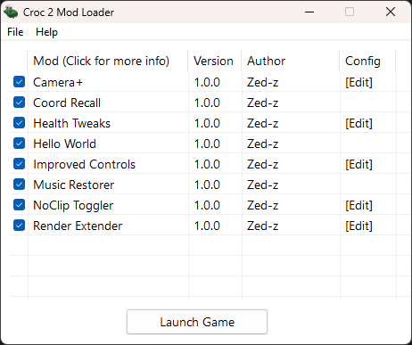

# Croc 2 Mod Loader



ASI Mod Loader for Croc 2

Will automatically load `.asi` files from the `mods/` folder.

Additionally, provides a lightweight API for mod developers.

# Compatible versions

-   Tested on the US PC version.
    -   SHA1: `C7E9ED848E311706DDE83116FD122A0B28B99261`
-   Your mileage may vary on other versions!

# Installation instructions

1. Make sure you have [Microsoft Visual C++ Redistributable (x86)](https://aka.ms/vs/17/release/vc_redist.x86.exe) installed
1. Download [dinput8.dll](https://github.com/ThirteenAG/Ultimate-ASI-Loader/releases/download/Win32-latest/dinput-Win32.zip) from ThirteenAG's [Ultimate ASI Loader](https://github.com/ThirteenAG/Ultimate-ASI-Loader)
1. Download the mod loader files from [Releases](https://github.com/Zed-z/c2-mod-loader/releases)
1. Extract both and place them into the game's directory
1. You're done, the game will now load mods from the `mods/` folder!
1. EXTRA: Unpack the provided example mods into the `mods/` folder after installation

# Recommended: Custom GUI support

In order to display custom GUIs, the mod loader needs the game to have [dgVoodoo2](https://dege.freeweb.hu/dgVoodoo2/dgVoodoo2/) applied.

Without it, the mod loader will continue to function, but you will not see the custom GUI overlay.

# Features

## Mod loading

Croc 2 Mod Loader can load `.asi` mod files that are able to change the game's behavior and ever override some assets!

Mods are written in C++ with the help of the provided modding API.

## Game launcher

Shows a launcher before starting the game. There, you can enable and disable your mods and change their settings!

## Mouse uncapture

Optionally, the loader can overwrite some game code responsible for capturing the mouse in the game window and making it visible. When enabled, the game never captures your mouse and acts like any other window. Cursor freedom at last!

Big thanks to hdc0 for the game insight that made this possible!

## Custom UI

With the help of ocornut's Dear ImGui, the game can display custom UI elements, providing a look into the game's inner workings. Mods can also add options to the menu bar for easy access to different features!

## Cheat code management

Did you know that Croc 2 has cheat codes you can type in on the main menu? They're neat, but pretty tedious to have to type out every time you launch the game. With Croc 2 Mod Loader, you can manage them with UI options. They also get saved across play sessions!

# Provided mods

Alongside the loader, I'm providing a couple of mods. They feature little tweaks and improvements to the game and can be used to learn mod API usage.

## Camera+

## Coord Recall

## Health Tweaks

## Hello World

## Improved Controls

## Music Restorer

## NoClip Toggler

## Render Extender

# Recommended mods

Mods not made by me, but worth checking out.

## Croc 2 FOV Fix

A mod that fixes your FOV at widescreen resolutions to prevent stretching. A must have for playing on modern displays. It's a standalone game mod, but you can put it in the `mods/` folder to manage it with Croc 2 Mod Loader!

You can grab it [here](https://community.pcgamingwiki.com/files/file/2969-croc-2-fov-fix/)!

# Mod development

## Prerequisites

1. Install Visual Studio and vcpkg
1. Install `imgui:x86-windows-static` and `minhook:x86-windows-static` with vcpkg

## Project setup

### A) From scratch

1. Create a `Dynamic-Link Library (DLL)` Project in Visual Studio
1. Select the `Release x86` launch configuration
1. Configure the project (`Right Click Project > Properties`):
    - `Advanced > Target File Extension`: .asi
    - `C/C++ > Language > C++ Language Standard`: ISO C++17 Standard (/std:c++17)
    - `C/C++ > Code Generation > Runtime Library`: Multi-threaded (/MT)
    - `C/C++ > Precompiled Headers > Precompiled Header`: Not Using Precompiled Headers
    - `vcpkg > Use Static Libraries`: Yes
    - Include the `ModApi.h` [header file](https://github.com/Zed-z/c2-mod-loader/blob/main/Shared/ModApi.h)
        - If using the provided Visual Studio solution:
            - `C/C++ > General > Additional Include Directories`: ..\Shared\
            - `Resources > General > Additional Include Directories`: ..\Shared\
            - `Right Click "Headers" > Add > Existing Item`: ..\Shared\ModApi.h
    - Copy the `Shared\Resource.rc` file into your project folder and add it as a Resource File
        - Adjust the `Name`, `Author`, `Description`, `Version` fields
1. Add your desired code to the `DllMain()` function
1. Example code template:

    ```c++
    #include "ModApi.h"
    #include <Windows.h>
    #include <iostream>

    ModApi* api = nullptr;

    BOOL APIENTRY DllMain(HMODULE hModule, DWORD reason, LPVOID) {
    	if (reason == DLL_PROCESS_ATTACH) {
    		api = LoadModApi();
    		if (!api) return FALSE;
    		api->LogInfo("Hello world!");
    	}
    	return TRUE;
    }
    ```

### B) From a template

1. Pull the repository and run `python create_mod.py <ModNamePascalCase>`
1. Load the newly created project into the Visual Studio solution
1. Adjust the project's Resource File
    - Adjust the `Name`, `Author`, `Description`, `Version` fields
1. Modify the code to your hearts content

## Building

1. Build the project with `Build > Build Solution / Build Project`
1. You now have an `.asi` file in the `Release/` folder, congratulations!
1. Put it in `mods/` to use

# Third-Party Libraries

This project uses the following libraries:

-   [Dear ImGui](https://github.com/ocornut/imgui) - Copyright (c) 2014-2025 Omar Cornut
-   [MinHook](https://github.com/TsudaKageyu/minhook) - Copyright (c) 2009-2017 Tsuda Kageyu

Licenses for the above mentioned libraries are included in `LICENSES/`.

# Third-Party Code

-   This project includes implementation code from [Dear ImGui](https://github.com/ocornut/imgui), licensed under the MIT License.

# Special thanks

-   Thanks to ThirteenAG for developing Ultimate ASI Loader (support [here](https://ko-fi.com/thirteenag))
-   Thanks to Dege for developing dgVoodoo2 (support [here](https://dege.freeweb.hu/))
-   Thanks to ocornut for developing Dear ImGui (support [here](https://github.com/ocornut/imgui/wiki/Funding))
-   Thanks to TsudaKageyu for developing Minhook (support [here](https://github.com/TsudaKageyu))
-   Thanks to Thermospore, hdc0, limbus, Ray and Rartrin from the Croc & Stuff Discord server for valuable insight about the game!
-   Thanks to Argonaut Games for developing Croc 2!
